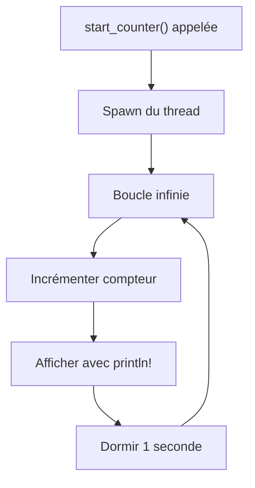
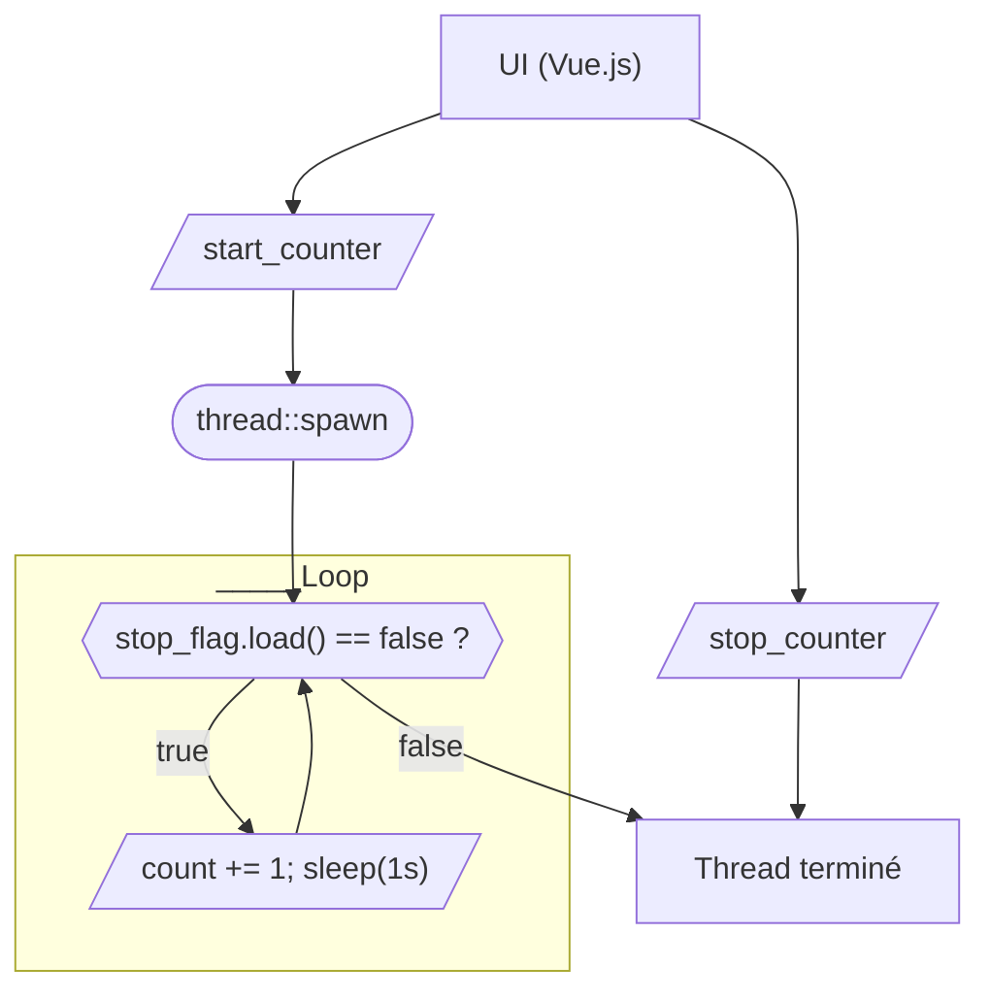
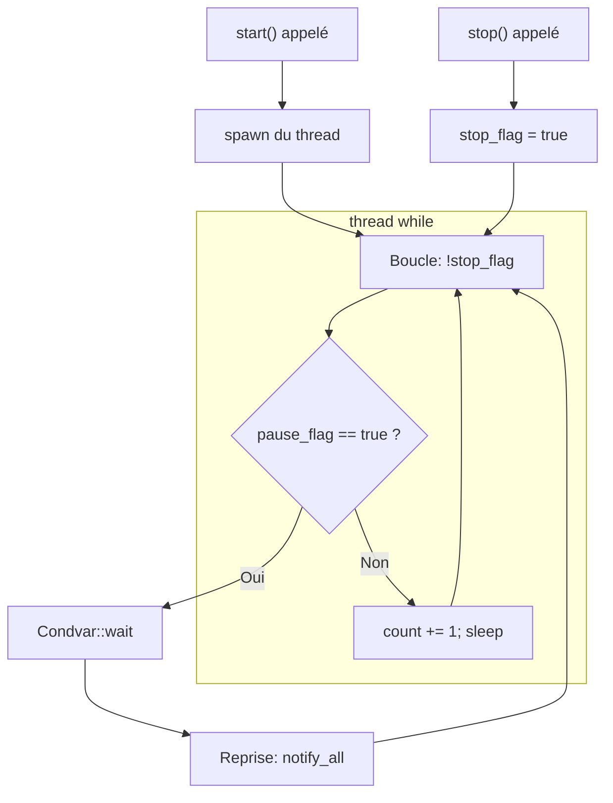
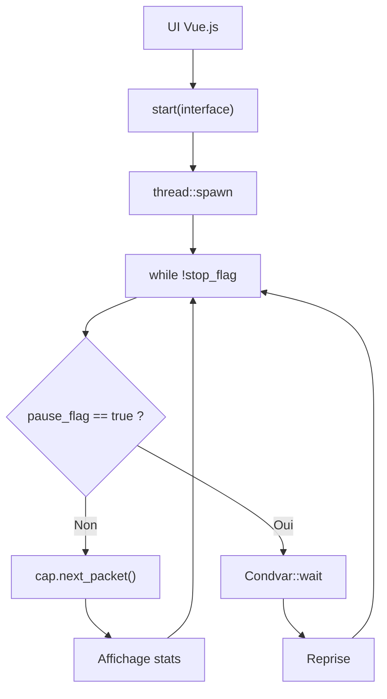
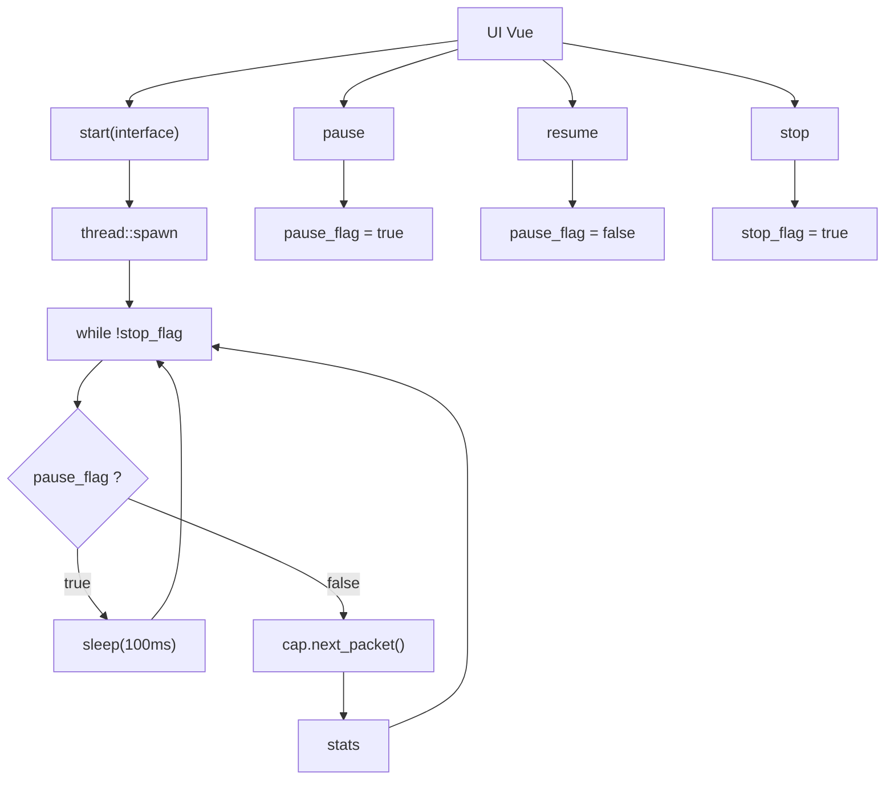
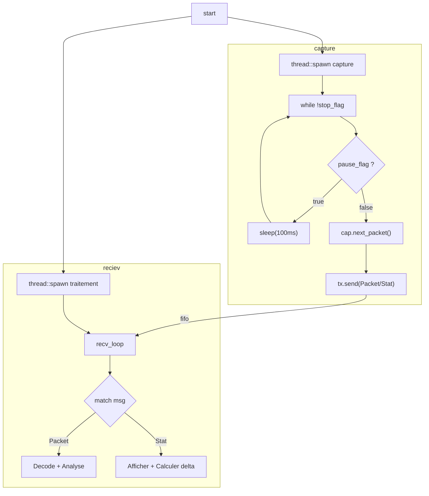
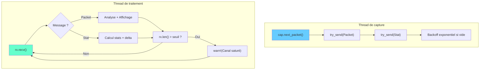

## Introduction

Pour comprendre comment capturer des paquets réseau en Rust dans une application **Tauri**, je vais te montrer **mon cheminement complet** — depuis l’idée d’un simple compteur jusqu’à une sonde réseau robuste.

Ce n’est pas juste un tutoriel. C’est un **journal technique**, une sorte de carnet de bord dans lequel chaque problème m’a permis d’apprendre quelque chose de nouveau : sur les threads, la gestion d’état, la communication UI/backend, ou les particularités de la crate `pcap`.

---

## 🛠 Étape 1 – Démarrer avec un compteur dans un thread

Avant de capturer des paquets réseau, je veux **maîtriser le principe d’un thread Rust contrôlé par Tauri**. Voici une fonction très simple qui **lance un thread de comptage** :

```rust
use tauri::command;
use std::time::Duration;
use std::thread;

/// Cette commande démarre un thread qui compte chaque seconde.
#[command(async)]
pub fn start_counter() {
    thread::spawn(move || {
        let mut count = 0;
        loop {
            count += 1;
            println!("Compteur: {}", count);
            thread::sleep(Duration::from_secs(1));
        }
    });

    println!("Thread de comptage lancé !");
}
```




---

## 🧩 Étape 2 – Ajouter le contrôle `start` / `stop` du thread

### 🧠 Objectif
Créer un **compteur Rust contrôlable** à travers des **commandes Tauri** :
- ✅ Démarrer le thread avec `start_counter`
- ✅ L’arrêter proprement avec `stop_counter`

---

### 📦 Architecture du code

#### 🧱 Backend (Rust)

Tu introduis :
- une structure globale `AppState` partagée dans un `Arc<Mutex<...>>`
- un `CounterHandle` qui possède un `stop_flag` partagé entre thread et handler
- deux commandes Tauri :
  - `start_counter` qui vérifie qu’il n’y a pas de thread déjà actif
  - `stop_counter` qui signale au thread qu’il doit s’arrêter

#### 💡 Extrait clé

```rust
pub fn stop(&self) {
    self.stop_flag.store(true, Ordering::Relaxed);
}
```

➡️ Cela coupe la boucle du thread dans `while !stop_flag.load(...)`.

---

### 🔂 Boucle de capture avec interruption

```rust
thread::spawn(move || {
    let mut count = 0;
    while !stop_flag.load(Ordering::Relaxed) {
        count += 1;
        println!("Compteur: {}", count);
        thread::sleep(Duration::from_secs(1));
    }
    println!("Thread terminé.");
});
```

---

### 🧠 Pourquoi `Arc<AtomicBool>` ?
- **`Arc`** permet de **partager la donnée entre le thread et l'extérieur** (via le `CounterHandle`)
- **`AtomicBool`** évite les verrous pour un flag booléen simple
- `Ordering::Relaxed` est suffisant ici : pas besoin de synchronisation complexe

---

### 🔗 Intégration avec Tauri

#### Commande `start_counter`

```rust
if app.counter.is_some() {
    println!("Déjà en cours.");
    return;
}
```

➡️ Tu empêches le démarrage de plusieurs threads (bonne pratique).

#### Commande `stop_counter`

```rust
if let Some(counter) = app.counter.take() {
    counter.stop();
}
```

➡️ Tu "consommes" le compteur en le retirant de l'état global (`take()`).

---

### 📊 Diagramme de séquence



---

## 🧠 Résultat de cette étape

- ✅ Tu contrôles **le lancement et l’arrêt** du thread à volonté.
- ✅ Tu gères **un seul thread actif à la fois**.
- ✅ Tu poses les bases pour les étapes suivantes : `pause`, `resume`, puis `pcap`.

---

## 📁 Étape 3 – Ajout de `pause` et `resume` avec `Condvar`

### 🌟 Objectif
Contrôler l'état d'exécution d'un thread via une **pause réversible**, sans tuer le thread, pour préparer les futurs cas d'usage comme la capture réseau avec interruption temporaire.

---

### 📄 Description technique

Tu introduis ici un **mécanisme de pause/reprise** avec :

- Un `Arc<(Mutex<bool>, Condvar)>` appelé `pause_flag`
- Le thread se met en attente (`Condvar::wait`) tant que `pause_flag == true`
- Une fonction `pause()` qui met `true`
- Une fonction `resume()` qui met `false` et `notify_all()`

---

### 🛠️ Architecture de la boucle

```rust
while !stop_flag.load(Ordering::Relaxed) {
    let (lock, cvar) = &*pause_flag;
    let mut paused = lock.lock().unwrap();

    if *paused {
        println!("[DEBUG] Le thread est en pause, en attente...");
    }

    while *paused {
        paused = cvar.wait(paused).unwrap();
        println!("[DEBUG] Signal de reprise reçu");
    }

    drop(paused);

    count += 1;
    println!("Compteur: {}", count);
    thread::sleep(Duration::from_secs(1));
}
```

---

### 🔊 Fonctionnement en flowchart



---

### 🔗 Pourquoi `Condvar` ici ?

- Permet de bloquer le thread efficacement (**pas de spin/sleep inutile**)
- Attente conditionnelle, sans gaspiller de CPU
- Synchronisation typique dans les threads bloquants

---

### 📊 Bilan de l'étape

| Fonction | Rôle |
|----------|------|
| `start()` | Lance le thread si pas déjà actif |
| `stop()` | Coupe la boucle et réveille s'il était en pause |
| `pause()` | Met le thread en attente |
| `resume()` | Réveille le thread bloqué |

---

### 📉 Limites observées

- Si on ne veut **pas bloquer** le thread (ex : avec `pcap` en mode `nonblock`), ce modèle est **trop complexe**
- Risques de **deadlock** ou de **signal perdu** si mal utilisé

**✅ C'est pour cette raison qu'à l'étape suivante, tu as décidé d'abandonner `Condvar` au profit d'un simple `AtomicBool`.**

---

## 📊 Etape 4 — Intégration de `pcap` avec pause/reprise

### 🚀 Objectif
Passer du compteur simple à une vraie capture de paquets réseau via la crate [`pcap`](https://docs.rs/pcap), tout en gardant la possibilité de mettre la capture **en pause** ou de l'arrêter grâce à des flags de contrôle partagés avec le thread de capture.

---

### 🔧 Code clé : struct `CaptureHandle`

```rust
pub struct CaptureHandle {
    stop_flag: Arc<AtomicBool>,
    pause_flag: Arc<(Mutex<bool>, Condvar)>,
}
```

- `stop_flag` : permet d'interrompre la boucle de capture
- `pause_flag` : permet de suspendre temporairement le thread sans le tuer

---

### 🪨 Logique de la boucle de capture

```rust
while !stop_flag.load(Ordering::Relaxed) {
    // pause si activée
    let (lock, cvar) = &*pause_flag;
    let mut paused = lock.lock().unwrap();
    while *paused {
        println!("[DEBUG] Pause active, en attente...");
        paused = cvar.wait(paused).unwrap();
        println!("[DEBUG] Reprise de la capture");
    }
    drop(paused);

    match cap.next_packet() {
        Ok(packet) => println!("[CAPTURE] paquet de {} octets", packet.data.len()),
        Err(e) => println!("[ERROR] Erreur de capture : {:?}", e),
    }

    let stats = cap.stats().unwrap();
    println!(
        "Received: {}, dropped: {}, if_dropped: {}",
        stats.received, stats.dropped, stats.if_dropped
    );
}
```

---

### 🛀 Flowchart



---

### ⚠️ Limites identifiées

- `Condvar` peut bloquer le thread **alors que `pcap` supporte le mode non-bloquant**
- La gestion des erreurs devient plus complexe si des signaux sont manqués (ex : `notify_all()` raté)
- Ce modèle est plus adapté à des processus **CPU-bloquants** que à de la capture IO non-bloquante

---

### 📊 Conclusion

Cette étape permet de valider la chaîne :
- Contrôle de thread avec pause/reprise sur une vraie capture réseau
- Intégration du `pcap::Capture` dans un thread
- Premiers tests de robustesse via `stop()` et `resume()`

❌ **Mais les limites du modèle avec `Condvar` se font sentir.**

🚧 Prochaine étape : remplacer `Condvar` par un simple `AtomicBool` pour un modèle plus adapté au non-blocking.

---
## 🚀 Etape 5 — Remplacement de `Condvar` par `AtomicBool`

### 🔄 Objectif
Remplacer la pause/reprise basée sur `Condvar` par une solution plus simple et plus robuste avec **un `AtomicBool`**, mieux adapté à la capture réseau en mode **non-bloquant** (`setnonblock()`).

---

### 🔧 Architecture du `CaptureHandle`

```rust
pub struct CaptureHandle {
    stop_flag: Arc<AtomicBool>,
    pause_flag: Arc<AtomicBool>,
}
```

- `stop_flag` : indique au thread de s'arrêter
- `pause_flag` : contrôle le gel temporaire de la capture

---

### ⚖️ Pourquoi abandonner `Condvar`

| `Condvar`                           | `AtomicBool`                          |
|------------------------------------|---------------------------------------|
| Bloque le thread                   | Polling actif mais contrôlé           |
| Difficile à synchroniser avec `pcap` | Compatible avec `setnonblock()`        |
| Risques de signal perdu            | Simplicité, aucun verrou requis       |

---

### ✅ Comportement de la boucle de capture

```rust
if pause_flag.load(Ordering::Relaxed) {
    thread::sleep(Duration::from_millis(100));
    continue;
}
```

Cela permet au thread de rester réactif et non-bloquant tout en réduisant la charge CPU.

---

### 📊 Affichage intelligent des stats

Un cache `last_stats` permet d'éviter d'afficher les statistiques en boucle :

```rust
if last_stats != Some(current) {
    println!("[STATS] Received: {}, dropped: {}, if_dropped: {}", ...);
    last_stats = Some(current);
}
```

---

### 🛀 Flowchart



---

### 🔍 Ce qu'on gagne

- Simplicité de la logique de pause
- Plus de compatibilité avec les captures `pcap` non bloquantes
- Moins de complexité et de risque de bug

---

### 🎉 Tu as maintenant :

- Un thread de capture **contrôlable en `start`, `stop`, `pause`, `resume`**
- Une capture réseau **performante et robuste**
- Un code propre, testable et cross-plateforme

Prochaine étape : 📊 **Séparer complètement la capture des paquets et leur traitement **


## 🧠 Étape 6 — Thread séparé pour traitement + stats

### 🎯 Objectif

Séparer complètement la **capture** des paquets et leur **traitement** (parse, stats, etc.) dans deux threads indépendants.

---

### 📦 Architecture

- Un `CaptureHandle` avec deux flags : `stop_flag` et `pause_flag`
- Un thread de **capture** qui lit les paquets via `pcap` et les envoie dans un canal
- Un thread de **traitement** qui lit depuis ce canal, décode les paquets, met à jour les compteurs et affiche les stats
- Un enum `CaptureMessage` pour transmettre soit un paquet, soit les statistiques `pcap::Stat`

---

### 📄 Enum pour messages

```rust
enum CaptureMessage {
    Packet(PacketOwned),
    Stats(Stat),
}
```

---

### 📄 Thread de capture

```rust
thread::spawn(move || {
    // boucle de capture pcap
    match cap.next_packet() {
        Ok(packet) => {
            let owned = codec.decode(packet);
            tx.send(CaptureMessage::Packet(owned)).unwrap();
        },
        // ...
    }
    // stats périodiques
    if let Ok(stats) = cap.stats() {
        tx.send(CaptureMessage::Stats(stats)).unwrap();
    }
});
```

---

### 📄 Thread de traitement

```rust
thread::spawn(move || {
    while let Ok(msg) = rx.recv() {
        match msg {
            CaptureMessage::Packet(pkt) => {
                println!("Packet len={} ts={}.{:06}", pkt.data.len(), pkt.header.ts.tv_sec, pkt.header.ts.tv_usec);
                // traitement, analyse...
            }
            CaptureMessage::Stats(stats) => {
                println!("[STATS] received={}, dropped={}, if_dropped={}...", stats.received, stats.dropped, stats.if_dropped);
            }
        }
    }
});
```

---

📊 Flowchart – Éviter les paquets perdus en déléguant le traitement

---

### ✅ Ce que cette étape apporte

| Gain | Détail |
|------|--------|
| 📦 Séparation des responsabilités | capture vs traitement |
| 🚀 Meilleure performance | capture non bloquée, traitement découplé |
| 🧱 Meilleure architecture | threads indépendants, plus testables |

---

### 🔜 Prochaines étapes d’optimisation

- 🔄 Utiliser `crossbeam::bounded()` pour remplacer `mpsc::sync_channel`

---

## 🧱 Étape 7 — Transition de `mpsc` vers `crossbeam::channel`

### Pourquoi changer ?

- `std::sync::mpsc` est simple, mais limité :
  - pas de fonction `len()`
  - performances moindres en haute fréquence
  - moins de flexibilité sur la stratégie de saturation

### Avantages concrets de `crossbeam::channel`

| Fonctionnalité           | `mpsc`              | `crossbeam::channel`         |
|--------------------------|---------------------|-------------------------------|
| Taille bornée (`bounded`) | ✅ (avec `sync_channel`) | ✅                           |
| `try_send()`             | ❌                  | ✅                            |
| `len()` pour monitoring  | ❌                  | ✅                            |
| Performances             | Moyennes            | Excellentes                  |
| Sécurité thread          | Bonne               | Très bonne                   |

### Code modifié

```rust
let (tx, rx) = crossbeam::channel::bounded::<CaptureMessage>(10_000);
```

Et dans le thread :

```rust
if let Err(err) = tx.try_send(CaptureMessage::Packet(owned)) {
    error!("[TX] Packet dropped (buffer plein) : {}", err);
}
```

---

### 🚦 Scénarios de saturation

- Le canal est plein car le thread de traitement est trop lent
- Grâce à `try_send()`, on peut **logguer ou ignorer** les paquets plutôt que bloquer
- Avec `rx.len()` on peut **détecter la saturation imminente** et **agir proactivement** (pause, discard, alertes...)

---

### 📄 Étape bonus : mise en place d’un **backoff exponentiel**

Quand `pcap` n’a pas de paquet à lire, on dort un tout petit peu — mais progressivement plus longtemps, jusqu’à 10 ms max.

```rust
let mut backoff = 1; // µs
backoff = (backoff * 2).min(10_000);
```

Cela **réduit la charge CPU** tout en gardant une réactivité raisonnable.

---

### 📄 Étape bonus : monitoring du canal

On mesure `rx.len()` dans le thread de traitement, et on déclenche un `warn!` si le canal est proche de la saturation :

```rust
if rx.len() > 9000 {
    warn!("[BACKPRESSURE] Canal presque plein !");
}
```

Cela permet de :
- Visualiser en prod si le thread de capture produit trop vite
- Éventuellement **adapter dynamiquement** la stratégie (discard, buffer, etc.)

---

### 📄 Thread de traitement

```rust
thread::spawn(move || {
    while let Ok(msg) = rx.recv() {
        match msg {
            CaptureMessage::Packet(pkt) => { /* traitement */ },
            CaptureMessage::Stats(stats) => { /* stats */ },
        }

        if rx.len() > 9000 {
            warn!("Canal presque saturé !");
        }
    }
});
```

---

### ✅ Ce que cette étape apporte

| Gain                              | Détail                                   |
| --------------------------------- | ---------------------------------------- |
| 📦 Séparation des responsabilités | capture vs traitement                    |
| 🚀 Meilleure performance          | capture non bloquée, traitement découplé |
| 🧱 Meilleure architecture         | threads indépendants, plus testables     |
| ⚠️ Détection proactive            | backpressure visible dans les logs       |

---

### 📊 Flowchart – Éviter les paquets perdus en déléguant le traitement



---

### 🔜 Prochaines étapes d’optimisation

- ♻️ Réutiliser les buffers (`Vec<u8>` pré-alloués)
- 🧠 Implémenter un pool d’objets pour éviter les reallocations fréquentes

Tu es maintenant prêt à **benchmark chaque taille de buffer**, et visualiser en direct l’impact sur la perf 🧪🚀

