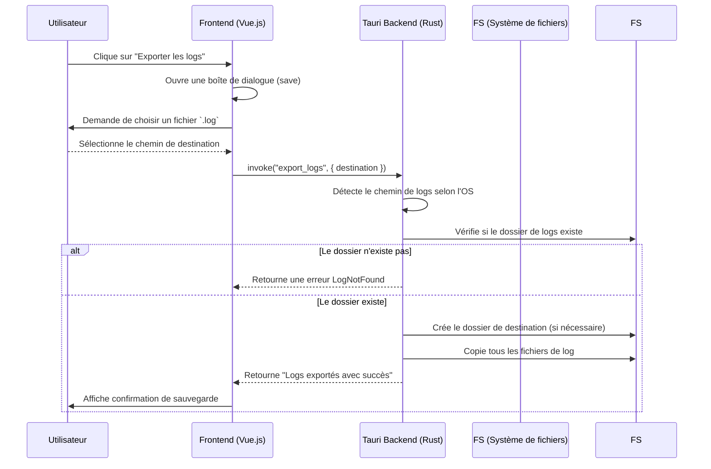

# 🧰 Tutoriel — Exporter proprement les logs d’une application Tauri (Linux, macOS, Windows)

> Apprenez à exporter facilement les fichiers de logs d’une application Tauri, quel que soit leur système d’exploitation, avec Rust et Tauri.

--- 

## 🔎 Pourquoi exporter les logs ?

Que ce soit pour résoudre un bug ou comprendre un comportement inattendu, les logs sont souvent le **premier réflexe** du développeur. Mais encore faut-il que l’utilisateur puisse y accéder et vous les transmettre facilement.

Dans ce tutoriel, on va :

✅ localiser le bon dossier de logs (selon l’OS)
✅ copier les fichiers dans un dossier choisi par l’utilisateur
✅ gérer les erreurs proprement avec `thiserror`
✅ intégrer le tout avec un bouton dans votre interface frontend

---

## 🗂️ Où sont les logs Tauri ?

Tauri enregistre les logs dans un dossier spécifique à chaque OS, basé sur le `bundleIdentifier` défini dans `tauri.conf.json`.

| OS      | Dossier de logs                                                  |
| ------- | ---------------------------------------------------------------- |
| Linux   | `$XDG_DATA_HOME/<bundle>/logs` ou `~/.local/share/<bundle>/logs` |
| Windows | `%LocalAppData%\<bundle>\logs`                                   |
| macOS   | `~/Library/Logs/<bundle>`                                        |

Par exemple, pour `fr.sonar.app`, on aura :

* Linux : `~/.local/share/fr.sonar.app/logs`
* Windows : `C:\Users\...\AppData\Local\fr.sonar.app\logs`
* macOS : `/Users/.../Library/Logs/fr.sonar.app`

---

## 🛠️ Étape 1 – Créer une commande Rust

Dans `src/commandes/export/logs.rs` :

```rust
use std::fs;
use std::path::PathBuf;
use tauri::command;

use crate::errors::export::ExportError;

#[command(async)]
pub fn export_logs(destination: String) -> Result<String, ExportError> {
    let log_dir: PathBuf = {
        #[cfg(target_os = "linux")]
        {
            let base = std::env::var("XDG_DATA_HOME")
                .map(PathBuf::from)
                .unwrap_or_else(|_| {
                    dirs::home_dir().unwrap().join(".local/share")
                });
            base.join("fr.sonar.app/logs")
        }

        #[cfg(target_os = "windows")]
        {
            dirs::data_local_dir()
                .unwrap_or_else(|| PathBuf::from("C:\\Users\\Default\\AppData\\Local"))
                .join("fr.sonar.app\\logs")
        }

        #[cfg(target_os = "macos")]
        {
            dirs::home_dir()
                .unwrap_or_else(|| PathBuf::from("/Users/Shared"))
                .join("Library/Logs/fr.sonar.app")
        }
    };

    if !log_dir.exists() {
        return Err(ExportError::LogNotFound);
    }

    let destination = PathBuf::from(destination);

    if !destination.exists() {
        fs::create_dir_all(&destination)
            .map_err(|e| ExportError::Io(format!("create_dir_all: {}", e)))?;
    }

    for entry in fs::read_dir(&log_dir).map_err(|e| ExportError::Io(format!("read_dir: {}", e)))? {
        let entry = entry.map_err(|e| ExportError::Io(format!("entry: {}", e)))?;
        let src_path = entry.path();
        if src_path.is_file() {
            let file_name = src_path.file_name().unwrap();
            let dest_path = destination.join(file_name);
            fs::copy(&src_path, &dest_path)
                .map_err(|e| ExportError::Io(format!("copy: {}", e)))?;
        }
    }

    Ok("Logs exportés avec succès".to_string())
}
```

---

## ❌ Gestion des erreurs : ExportError

Dans `src/errors/export.rs` :

```rust
use thiserror::Error;

#[derive(Debug, Error, serde::Serialize)]
pub enum ExportError {
    #[error("Erreur d'E/S : {0}")]
    Io(String),

    #[error("Le dossier de logs est introuvable.")]
    LogNotFound,
}
```

---

## 🧩 Étape 2 – Frontend avec boîte de dialogue

Voici comment appeler cette commande proprement depuis le frontend, avec Tauri API :

```ts
import { save } from '@tauri-apps/api/dialog';
import { invoke } from '@tauri-apps/api/tauri';
import { info } from './log'; // ou console.log

export async function export_logs() {
  info("export logs");

  const response = await save({
    filters: [{
      name: '.log',
      extensions: ['log']
    }],
    title: 'Sauvegarder les logs',
    defaultPath: 'sonar.log'
  });

  if (response) {
    const saveResponse = await invoke('export_logs', { destination: response });
    info("Sauvegarde terminée:", saveResponse);
    return saveResponse;
  } else {
    info("Aucun chemin de fichier sélectionné");
    throw new Error("Sauvegarde annulée ou chemin non sélectionné");
  }
}
```

---

## 📈 Diagramme de séquence

Voici le comportement complet en diagramme Mermaid :



---

## 🧠 Bonnes pratiques

* Ne faites jamais l’hypothèse que le dossier existe : testez-le.
* Proposez une interface claire : nom du fichier, filtre `.log`, message de confirmation.
* Gérez les erreurs côté frontend **et** backend.
* Utilisez des noms de fichiers uniques si vous exportez plusieurs fois.

---

## 🧪 Aller plus loin

* 💾 Ajouter la compression des logs (`zip` ou `tar.gz`)
* 📬 Proposer un envoi automatique par mail (attention RGPD)
* 🧠 Ajouter des métadonnées : version, date, config système

---

## ✅ Conclusion

Exporter les logs proprement, c’est un petit effort pour le développeur, mais un **gain énorme** pour le support. Avec Tauri, Rust et une bonne séparation frontend/backend, c’est facile, portable et fiable.
