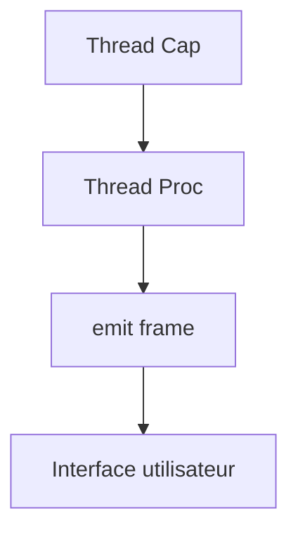

# 🛰️ Journalisation des paquets réseau dans l'application SONAR

## 📌 Objectif

L’objectif du logging des paquets dans SONAR est de fournir une **trace en temps réel** des trames capturées sur les interfaces réseau. Cela permet :

- 🕵️‍♂️ D’inspecter les paquets au fur et à mesure de leur réception.
- 📊 D’observer les caractéristiques des flux réseau (protocole, IP, ports...).
- ⏱️ De diagnostiquer rapidement des anomalies de trafic ou de configuration.
- 🧠 D’alimenter une interface utilisateur réactive pour l’analyse en direct.

---

## 🧱 Architecture de la journalisation

La capture et l’affichage en temps réel dans SONAR repose sur une architecture en **thread parallèle** avec communication via **canal Crossbeam** :



* `Thread Cap` : capture les paquets en brut via `pcap`.
* `Thread Proc` : transforme chaque paquet en structure `PacketFlow`, puis les envoie à l'UI via `emit`.
* Frontend Vue.js : écoute les événements `frame` et affiche les derniers paquets reçus.

---

## 📦 Structure du paquet journalisé

Chaque paquet est encapsulé dans une structure Rust typée :

```rust
#[derive(Debug, Clone, Serialize)]
pub struct PacketFlow {
    pub ts_sec: i64,
    pub ts_usec: i64,
    pub caplen: u32,
    pub len: u32,
    pub flow: PacketInfos,
    pub formatted_time: String, // Ex: "14:35:09.366315"
}
```

Le champ `flow` contient les informations multi-couches :

```rust
pub struct PacketInfos {
    pub mac_address_source: String,
    pub mac_address_destination: String,
    pub interface: String,
    pub l_3_protocol: String,
    pub layer_3_infos: Option<Layer3Infos>,
    pub packet_size: u32,
}
```

---

## ⏲️ Formatage de l’horodatage

Pour faciliter la lecture humaine et l’alignement temporel, un champ `formatted_time` est injecté dans le backend lors de la création de chaque paquet :

```rust
fn format_timestamp(ts_sec: i64, ts_usec: i64) -> String {
    use chrono::{NaiveDateTime, Timelike};
    let naive = NaiveDateTime::from_timestamp_opt(ts_sec, (ts_usec * 1000) as u32)
        .unwrap_or_else(|| NaiveDateTime::from_timestamp_opt(0, 0).unwrap());
    let micro = ts_usec % 1_000_000;

    format!(
        "{:02}:{:02}:{:02}.{:06}",
        naive.hour(),
        naive.minute(),
        naive.second(),
        micro
    )
}
```

---

## 🧑‍💻 Affichage dans l’interface

La table Vue.js est liée à un tableau `frames` :

```vue
<tr v-for="(frame, index) in frames" :key="index">
  <td>{{ frame.flow.mac_address_source }}</td>
  <td>{{ frame.flow.mac_address_destination }}</td>
  <td>{{ frame.flow.interface }}</td>
  <td>{{ frame.flow.l_3_protocol }}</td>
  <td>{{ frame.flow.layer_3_infos?.ip_source || '-' }}</td>
  <td>{{ frame.flow.layer_3_infos?.ip_destination || '-' }}</td>
  <td>{{ frame.flow.layer_3_infos?.l_4_protocol || '-' }}</td>
  <td>{{ frame.flow.layer_3_infos?.layer_4_infos?.port_source || '-' }}</td>
  <td>{{ frame.flow.layer_3_infos?.layer_4_infos?.port_destination || '-' }}</td>
  <td>{{ frame.flow.layer_3_infos?.layer_4_infos?.l_7_protocol || '-' }}</td>
  <td>{{ frame.flow.packet_size }}</td>
  <td>{{ frame.formatted_time }}</td>
</tr>
```

---

## 🛑 Limitation volontaire : uniquement les 5 derniers paquets

Afin de ne pas saturer l'interface, le backend conserve une **file circulaire de 5 paquets** :

```rust
if last_packets.len() == 5 {
    last_packets.pop_back();
}
last_packets.push_front(packet_info);
```

---

## 🔄 Réinitialisation

Un événement `reset` est écouté côté frontend pour vider la table :

```js
this.$bus.on('reset', () => {
  this.frames = [];
});
```

---

## ✅ Conclusion

Le logging réseau en temps réel dans SONAR est une brique essentielle pour :

* L’analyse instantanée du trafic
* Le débogage
* Le contrôle de performance des captures

Cette architecture basée sur Tauri, Crossbeam et Vue.js offre à la fois performance, clarté et réactivité.

---

🛠️ Besoin de plus ?
SONAR peut évoluer pour afficher :

* Une timeline horizontale en temps réel

