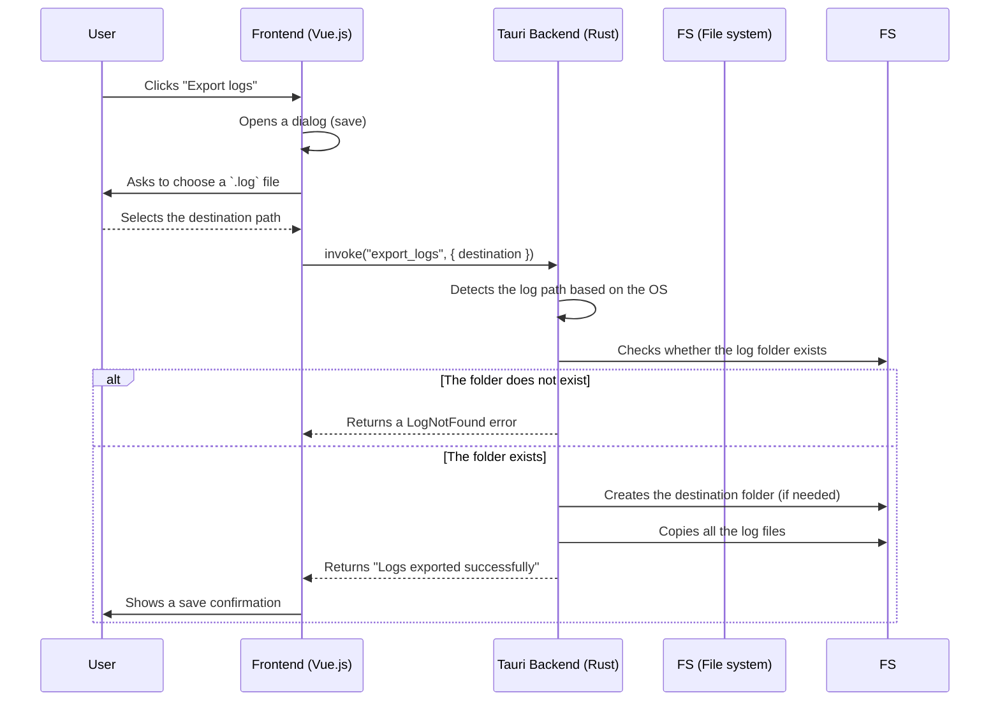

# 🧰 Tutorial — Cleanly exporting logs from a Tauri application (Linux, macOS, Windows)

> Learn how to easily export the log files of a Tauri application, whatever their
> operating system, with Rust and Tauri.

---

## 🔎 Why export logs?

Whether to fix a bug or understand unexpected behavior, logs are often the
developer's **first reflex**. But the user still needs to be able to access them
and send them to you easily.

In this tutorial, we will:

✅ locate the right log folder (depending on the OS)
✅ copy the files into a folder chosen by the user
✅ handle errors cleanly with `thiserror`
✅ wire it all up with a button in your frontend interface

---

## 🗂️ Where are the Tauri logs?

Tauri stores logs in an OS-specific folder, based on the `bundleIdentifier`
defined in `tauri.conf.json`.

| OS      | Log folder                                                       |
| ------- | ---------------------------------------------------------------- |
| Linux   | `$XDG_DATA_HOME/<bundle>/logs` or `~/.local/share/<bundle>/logs` |
| Windows | `%LocalAppData%\<bundle>\logs`                                   |
| macOS   | `~/Library/Logs/<bundle>`                                        |

For example, for `fr.sonar.app`, we get:

* Linux: `~/.local/share/fr.sonar.app/logs`
* Windows: `C:\Users\...\AppData\Local\fr.sonar.app\logs`
* macOS: `/Users/.../Library/Logs/fr.sonar.app`

---

## 🛠️ Step 1 – Create a Rust command

In `src/commandes/export/logs.rs`:

```rust
use std::fs;
use std::path::PathBuf;
use tauri::command;

use crate::errors::export::ExportError;

#[command(async)]
pub fn export_logs(destination: String) -> Result<String, ExportError> {
    let log_dir: PathBuf = {
        #[cfg(target_os = "linux")]
        {
            let base = std::env::var("XDG_DATA_HOME")
                .map(PathBuf::from)
                .unwrap_or_else(|_| {
                    dirs::home_dir().unwrap().join(".local/share")
                });
            base.join("fr.sonar.app/logs")
        }

        #[cfg(target_os = "windows")]
        {
            dirs::data_local_dir()
                .unwrap_or_else(|| PathBuf::from("C:\\Users\\Default\\AppData\\Local"))
                .join("fr.sonar.app\\logs")
        }

        #[cfg(target_os = "macos")]
        {
            dirs::home_dir()
                .unwrap_or_else(|| PathBuf::from("/Users/Shared"))
                .join("Library/Logs/fr.sonar.app")
        }
    };

    if !log_dir.exists() {
        return Err(ExportError::LogNotFound);
    }

    let destination = PathBuf::from(destination);

    if !destination.exists() {
        fs::create_dir_all(&destination)
            .map_err(|e| ExportError::Io(format!("create_dir_all: {}", e)))?;
    }

    for entry in fs::read_dir(&log_dir).map_err(|e| ExportError::Io(format!("read_dir: {}", e)))? {
        let entry = entry.map_err(|e| ExportError::Io(format!("entry: {}", e)))?;
        let src_path = entry.path();
        if src_path.is_file() {
            let file_name = src_path.file_name().unwrap();
            let dest_path = destination.join(file_name);
            fs::copy(&src_path, &dest_path)
                .map_err(|e| ExportError::Io(format!("copy: {}", e)))?;
        }
    }

    Ok("Logs exported successfully".to_string())
}
```

---

## ❌ Error handling: ExportError

In `src/errors/export.rs`:

```rust
use thiserror::Error;

#[derive(Debug, Error, serde::Serialize)]
pub enum ExportError {
    #[error("I/O error: {0}")]
    Io(String),

    #[error("The log folder could not be found.")]
    LogNotFound,
}
```

---

## 🧩 Step 2 – Frontend with a dialog box

Here is how to call this command cleanly from the frontend, with the Tauri API:

```ts
import { save } from '@tauri-apps/api/dialog';
import { invoke } from '@tauri-apps/api/tauri';
import { info } from './log'; // or console.log

export async function export_logs() {
  info("export logs");

  const response = await save({
    filters: [{
      name: '.log',
      extensions: ['log']
    }],
    title: 'Save the logs',
    defaultPath: 'sonar.log'
  });

  if (response) {
    const saveResponse = await invoke('export_logs', { destination: response });
    info("Save complete:", saveResponse);
    return saveResponse;
  } else {
    info("No file path selected");
    throw new Error("Save cancelled or path not selected");
  }
}
```

---

## 📈 Sequence diagram

Here is the full behavior as a Mermaid diagram:



---

## 🧠 Best practices

* Never assume the folder exists: check it.
* Offer a clear interface: file name, `.log` filter, confirmation message.
* Handle errors on the frontend **and** the backend.
* Use unique file names if you export several times.

---

## 🧪 Going further

* 💾 Add log compression (`zip` or `tar.gz`)
* 📬 Offer automatic email sending (mind GDPR)
* 🧠 Add metadata: version, date, system config

---

## ✅ Conclusion

Exporting logs cleanly is a small effort for the developer, but a **huge gain**
for support. With Tauri, Rust and a good frontend/backend separation, it is easy,
portable and reliable.
