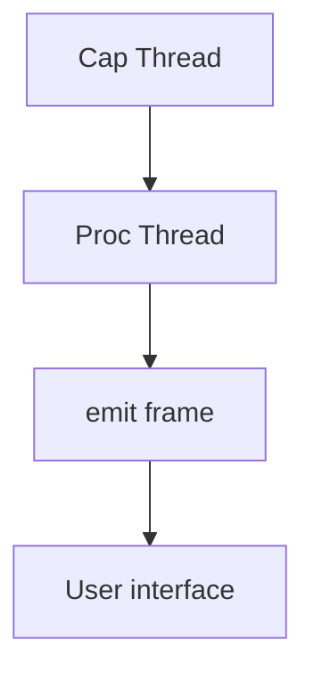

# 🛰️ Network packet logging in the SONAR application

## 📌 Goal

The goal of packet logging in SONAR is to provide a **real-time trace** of the
frames captured on the network interfaces. This makes it possible to:

- 🕵️‍♂️ Inspect packets as they are received.
- 📊 Observe the characteristics of network flows (protocol, IP, ports...).
- ⏱️ Quickly diagnose traffic or configuration anomalies.
- 🧠 Feed a responsive user interface for live analysis.

---

## 🧱 Logging architecture

Real-time capture and display in SONAR rely on a **parallel thread**
architecture communicating through a **Crossbeam channel**:



* `Cap Thread`: captures raw packets via `pcap`.
* `Proc Thread`: transforms each packet into a `PacketFlow` structure, then sends them to the UI via `emit`.
* Vue.js frontend: listens for `frame` events and displays the latest received packets.

---

## 📦 Structure of the logged packet

Each packet is wrapped in a typed Rust structure:

```rust
#[derive(Debug, Clone, Serialize)]
pub struct PacketFlow {
    pub ts_sec: i64,
    pub ts_usec: i64,
    pub caplen: u32,
    pub len: u32,
    pub flow: PacketInfos,
    pub formatted_time: String, // e.g. "14:35:09.366315"
}
```

The `flow` field holds the multi-layer information:

```rust
pub struct PacketInfos {
    pub mac_address_source: String,
    pub mac_address_destination: String,
    pub interface: String,
    pub l_3_protocol: String,
    pub layer_3_infos: Option<Layer3Infos>,
    pub packet_size: u32,
}
```

---

## ⏲️ Timestamp formatting

To ease human reading and temporal alignment, a `formatted_time` field is
injected in the backend when each packet is created:

```rust
fn format_timestamp(ts_sec: i64, ts_usec: i64) -> String {
    use chrono::{NaiveDateTime, Timelike};
    let naive = NaiveDateTime::from_timestamp_opt(ts_sec, (ts_usec * 1000) as u32)
        .unwrap_or_else(|| NaiveDateTime::from_timestamp_opt(0, 0).unwrap());
    let micro = ts_usec % 1_000_000;

    format!(
        "{:02}:{:02}:{:02}.{:06}",
        naive.hour(),
        naive.minute(),
        naive.second(),
        micro
    )
}
```

---

## 🧑‍💻 Display in the interface

The Vue.js table is bound to a `frames` array:

```vue
<tr v-for="(frame, index) in frames" :key="index">
  <td>{{ frame.flow.mac_address_source }}</td>
  <td>{{ frame.flow.mac_address_destination }}</td>
  <td>{{ frame.flow.interface }}</td>
  <td>{{ frame.flow.l_3_protocol }}</td>
  <td>{{ frame.flow.layer_3_infos?.ip_source || '-' }}</td>
  <td>{{ frame.flow.layer_3_infos?.ip_destination || '-' }}</td>
  <td>{{ frame.flow.layer_3_infos?.l_4_protocol || '-' }}</td>
  <td>{{ frame.flow.layer_3_infos?.layer_4_infos?.port_source || '-' }}</td>
  <td>{{ frame.flow.layer_3_infos?.layer_4_infos?.port_destination || '-' }}</td>
  <td>{{ frame.flow.layer_3_infos?.layer_4_infos?.l_7_protocol || '-' }}</td>
  <td>{{ frame.flow.packet_size }}</td>
  <td>{{ frame.formatted_time }}</td>
</tr>
```

---

## 🛑 Deliberate limitation: only the last 5 packets

To avoid flooding the interface, the backend keeps a **circular queue of 5
packets**:

```rust
if last_packets.len() == 5 {
    last_packets.pop_back();
}
last_packets.push_front(packet_info);
```

---

## 🔄 Reset

A `reset` event is listened for on the frontend to clear the table:

```js
this.$bus.on('reset', () => {
  this.frames = [];
});
```

---

## ✅ Conclusion

Real-time network logging in SONAR is an essential building block for:

* Instant traffic analysis
* Debugging
* Capture performance control

This architecture based on Tauri, Crossbeam and Vue.js offers performance,
clarity and responsiveness all at once.

---

🛠️ Need more?
SONAR can evolve to display:

* A horizontal, real-time timeline
